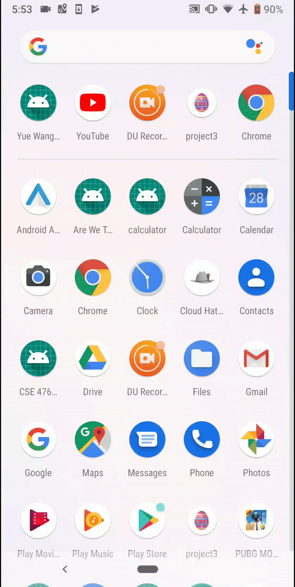

# Software development techniques for mobile devices such as smart phones and tablet computers.

# Step 1: 
 Introduction to Android Software Development 
# Step 2: 
 The Puzzle Game/Layouts and Views 
# Step 3: 
 The Puzzle Game/Touch, Persistence, and Finishing Touches 
 ## DEMO
   
# Step 4:
 The Mad Hatter Due 
 ## DEMO
   
# Step 5: 
 The Mad Hatter in the Cloud 
# Step 6: 
 The Mad Hatter in your Cloud 
# Step 7
 Are we there yet
  ## DEMO
 
